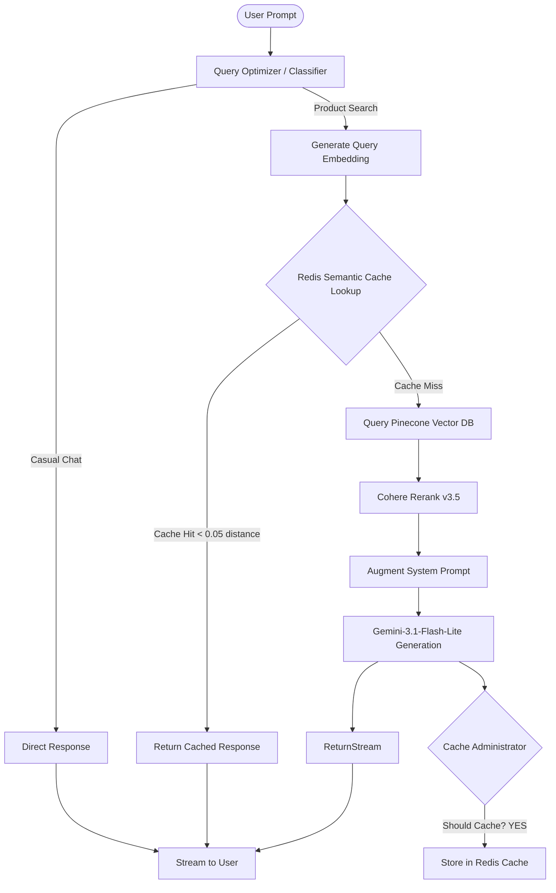

# RAG-Based Chatbot with Semantic Caching & Reranking

An advanced, enterprise-ready Retrieval-Augmented Generation (RAG) E-commerce Chatbot application built using **Next.js**, **Vercel AI SDK**, **Google Gemini**, **Pinecone**, **Redis**, and **Cohere**. 

This system implements critical performance and cost-optimization techniques including dynamic query intent optimization, vector-based semantic caching, and relevance-score reranking.

---

## 🌟 Key Features

*   **Intelligent Query Intent Classification**: Automatically classifies incoming queries into conversational greetings or product searches. Rewrites product queries to be optimized for vector lookup.
*   **Vector Search & Document Retrieval**: Indexes and queries product catalogs and business policies inside a serverless **Pinecone** vector database using `gemini-embedding-2` 1536-dimensional vectors.
*   **Semantic Caching**: Saves API costs and significantly reduces response times. Queries are converted to embeddings and looked up in a **Redis** cache via a K-Nearest Neighbors (KNN) cosine similarity search. If a highly similar query (distance `< 0.05`) is found, the cached response is served instantly.
*   **Document Reranking**: Utilizes the **Cohere Rerank v3.5** API to prioritize retrieved context relevance, boosting retrieval accuracy and feeding the most critical context to the LLM.
*   **Automated Ingestion Pipeline**: Contains a pre-built script to clear, clean, embed, and index both unstructured documentation (`.txt`) and structured product data (`.json`) into Pinecone.

---

## 🛠️ Tech Stack & Architecture



*   **Framework**: [Next.js](https://nextjs.org/) (App Router)
*   **LLM Orchestrator**: [Vercel AI SDK](https://sdk.vercel.ai/docs)
*   **LLM Model**: Google Gemini (`gemini-3.1-flash-lite`)
*   **Embeddings**: Google Gemini (`gemini-embedding-2` - 1536 dimensions)
*   **Vector Database**: [Pinecone](https://www.pinecone.io/)
*   **Semantic Cache**: [Redis Cloud](https://redis.io/) (utilizing Redis FT vector indices & HNSW algorithm)
*   **Reranking**: [Cohere Rerank v3.5](https://cohere.com/rerank)

---

## 🚀 Getting Started

### 📋 Prerequisites

*   Node.js v18 or later
*   Pinecone Database account and API key
*   Redis instance (supporting Redis Search / Vector modules, e.g., Redis Cloud)
*   Google AI Studio API Key (Gemini)
*   Cohere account and API Key

### 📁 Environment Setup

Create a `.env` file in the root directory of your project and configure the following credentials:

```env
GOOGLE_GENERATIVE_AI_API_KEY=your_gemini_api_key_here
PINECONE_API_KEY=your_pinecone_api_key_here
REDIS_HOST=your_redis_host_here
REDIS_PASSWORD=your_redis_password_here
COHERE_API_KEY=your_cohere_api_key_here
```

### 📥 Installation

1. Clone the repository and navigate to the project directory:
   ```bash
   git clone https://github.com/MuhammadAhmad-9/rag-chatbot.git
   cd rag-chatbot
   ```

2. Install dependencies:
   ```bash
   npm install
   ```

### ⚡ Running Ingestion Pipeline

To populate your Pinecone vector database with the local documents located in `src/agents/documents/` (e.g., product lists, FAQs, store policies):

```bash
npm run ingest
```

### 💻 Running the Application

Start the local development server:

```bash
npm run dev
```

Open [http://localhost:3000](http://localhost:3000) in your browser to chat with your smart assistant.

---

## ⚙️ How It Works under the Hood

1. **Query Optimization**: When a query comes in, `queryOptimizer()` classifies if it's greeting/casual or product-focused. If product-focused, it translates the query into an optimized form tailored for retrieval.
2. **Semantic Cache Lookup**: A vector representation of the query is searched in Redis against previously saved query vectors. If the cosine distance is close to `0`, the cache returns the answer immediately.
3. **Retrieval & Reranking**: If there's a cache miss, Pinecone is queried for the top 10 relevant document chunks. The results are passed to Cohere's rerank engine, narrowing the context to the top 5 most relevant documents.
4. **Response Generation**: The reranked context and conversation history are used to build an augmented system prompt for `gemini-3.1-flash-lite`, which generates the response stream.
5. **Dynamic Cache Admin**: After generating the response, a background evaluator checks whether the QA pair is universally useful to cache (excluding greetings, session-specific data, etc.) and writes it to Redis if eligible.
